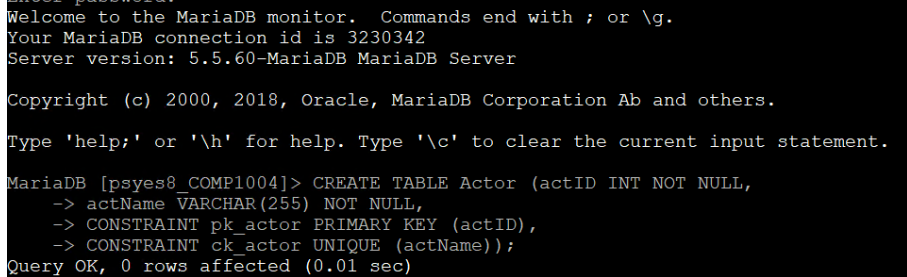
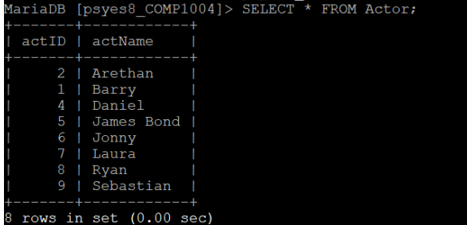
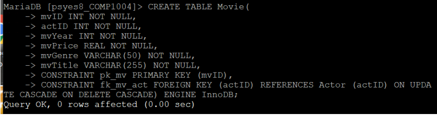
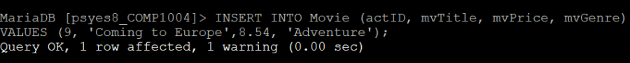
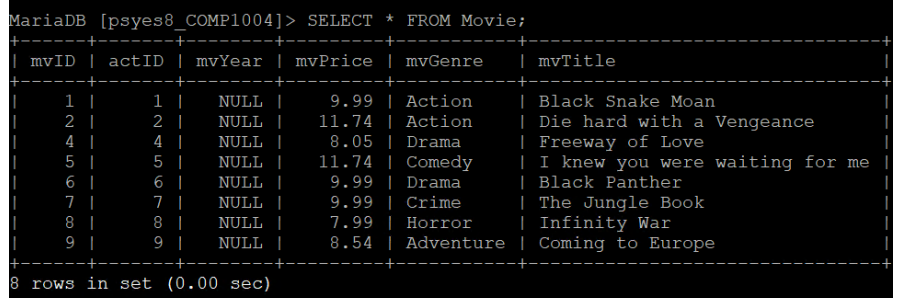

# FILM HOUSE WEBSITE AND DATABASE
## Project background

This project was completed during year 1 of my undergraduate computer science degree. It was my first experience using SQL, HTML, etc. 

## Project outline

The project revolved around a film house. The owners wanted a database to be created that stored the details of all of the films in their collection, including their name, price, year of release, genre and main actor.

They also then wanted a website through which they could interact with the database. 

## SQL

I created the database on my university's SQL server using a command line. The below images depict how I achieved this.

I chose to create two separate tables, one for movies and one for actors to make flow of any changes simpler - an actor could be the lead in multiple movies whereas each movie only has one lead. If the actor details changed for example, being able to update the actors table and this thus update all instances in the films table makes maintenance of the overall database much easier then trying to update individual film records.

#### ER diagram:

#### Actor table:
##### Creation of Actor table:

##### Example: populating Actor table

##### Final actor table

#### Movie table
##### Creation of Movie table

##### Example: populating Movie table

##### Final Movie table

## Content overview
**Please note: I have separated the code into 'language' files for ease of reference however to successfully run the web page and commands all code would need to be included within one file - see [public_html](./public_html/) (file I used)**

| Folder | Content |
|--------|---------|
|[HTML](./HTML/)| This folder contains the HTML script which is the foundations of the webpage as well as the images the HTML script references|
|[CSS](./CSS/)| This folder contains the 'styles' script which defines specific stylistic decisions pertaining to the web pages appearance|
|[JavaScript](./JavaScript/)| The script in this folder handles the validation of user inputs|
|[php](./php/)| This folder contains 6 scripts, each of which carry out a different SQL function e.g: deleting a movie from the Movie table based on user inputs.|

## Improvements

I am happy with the database I created during this project, however I feel that the appearance of the web page produced could be improved. Were I to come back to this in the future or complete the project again, I would experiment with more visually interesting backgrounds, buttons, animations, etc to enable users to have a better experience when interacting with the page.

